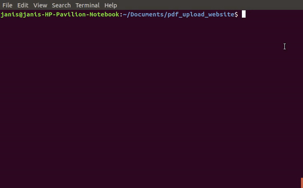
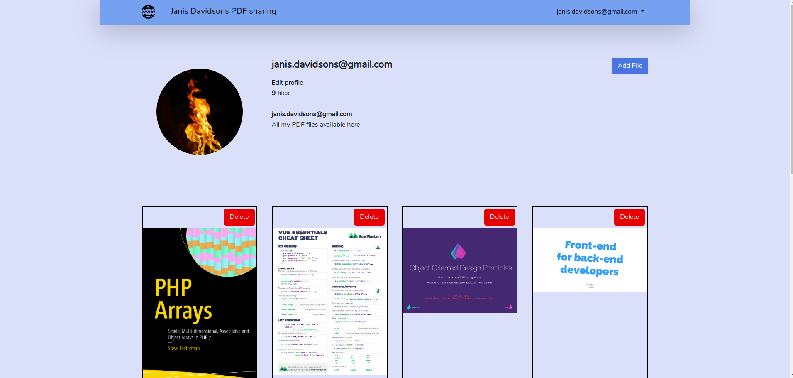
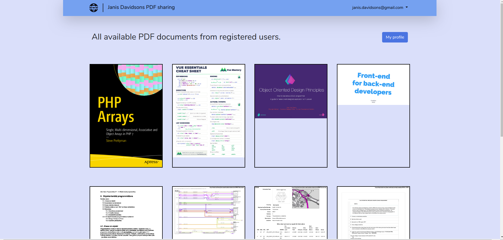
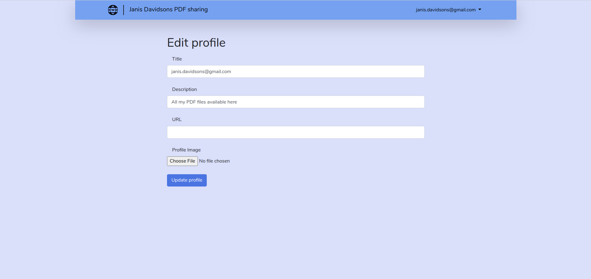

# PDF sharing website

This project is PDF document sharing platform. 
Each registered user can upload and delete his own PDF document. Users can see all
uploaded pdf files, but delete only owned ones.
Users can edit their profile, add description, url and upload their
profile image.

 Please follow instructions below to run it on your local machine.
    
    First go to https://github.com/JanisDavidsons/pdf_upload_website and
    copy project adress. 
    
   

    Then open terminal within a folder, were you want to download this project.
    Enter command "git clone https://github.com/JanisDavidsons/pdf_upload_website ."
    Dont forget to add dot at the end of address. 
    This will extract all project content in that folder.

   

    Install Composer Dependencies.
    "composer install"

   

    Install NPM Dependencies.
    "npm install"
    
   

    Create a copy of your .env file.
    "cp .env.example .env"
    
   

    Generate an app encryption key.
    "php artisan key:generate"
    
   

    Create new file in databse folder with command "touch database.sqlite"
    You can use any database, but in this example I`m using sqlite.
    
   

     In the .env file, add database information to allow Laravel to connect to the database.  
     Leave only this part in database section "DB_CONNECTION=sqlite"  

   
   

    Migrate the database
   

    Link public folder, where images will be stored.
    "php artisan storage:link"
   
   
    Run local server with command "php artisan serve"
    Open adress displayed in terminal, register and enjoy!
   
       
    

This exercise shows:
 
          * How buld software to upload files.
          * How to restrict user permissons.
          * Display PDF file thumbnails.
          * Display document, when clicked on it.
          * Delete file and its records from database.
          
Some example screenshots of project:

   
   
   
   
   

   

          
